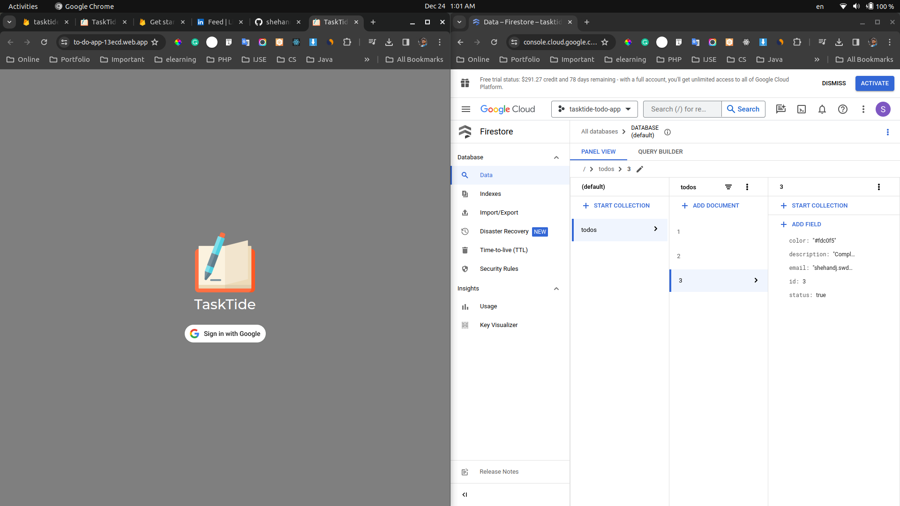

# TaskTide Web App Back End Using Springboot

### Version
1.0.0

### License
Copyright &copy; 2023 Shehan Rathnayake. All Rights Reserved. 
This project is licensed under [MIT License](License.txt).

## Introduction

Welcome to TaskTide back-end API built using Springboot. The Firebase Firestore was selected as the database management system and the project has been successfully deployed to Google Cloud Platform.

## Tech Stack Used

- **Back End** - Java, Springboot
- **Database** - Firebase Firestore
- **Hosting** - Google Cloud Platform

## Supported Links

- [Back-end - API URL with user email](https://tasktide-todo-app.df.r.appspot.com/api/v1/todos?email=shehandj.swd@gmail.com) 👈
- [Front-end - Hosted Website URL on Firebase](https://to-do-app-13ecd.web.app/) 👈
- [Front-end GitHub Repository](https://github.com/shehanrathnayake/tasktide-web-todo-app-front-end-react) 👈

### Support

***If you like what I do, maybe consider buying me a coffee*** 🥺 👇

  